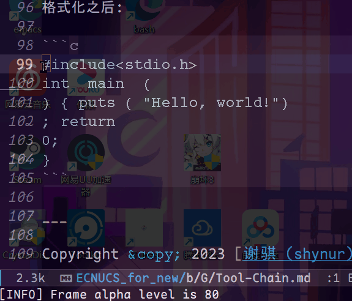

<!-- -*- coding: utf-8-unix; -*- -->

# 工具链

(本文仍在更新中.)

小白常见的问题就是面对众多工具不知从何下手, 空有写代码的知识, 却不知道如何构建一个程序.  (哥们见过一整个学期都用 OJ 写代码的人 😓.)
选择好的工具链, 形成路径依赖, 快速上手, 使你能够专注于眼前的任务.

本文将仅以 C 语言开发为例.

## 组成

一套典型的 C 程序开发流程应当有以下组成部分:

1. 编辑器.
   用于编写代码.
   虽然 IDE 也有类似的功能, 但是它屏蔽了太多的 (我们有义务知道的) 细节, 本文着重讲原理, 知道原理以后再使用 IDE, 就会有种一切尽在掌控之中的感觉.

2. 版本管理系统.
   用于记录项目的每一次迭代.
   专业的软件工程师不会应聘任何一家不使用 版本管理系统 的公司.

3. 格式化工具.
   美化你写的人神共愤的代码.

4. 编译器.
   用于将你写的源码处理成二进制文件.
   本文所说的编译器指的是 `gcc` 这种集 *编译*, *链接* 等功能于一体的缝合怪.

5. 构建系统.
   你会对你的项目文件进行各种操作 (例如, 编译), 构建系统将这一流程自动化.

6. 平台.
   可以理解为操作系统, 因为 MS-Windows 系和 UNIX 系上的工具集差别挺大的.

___

## Editor

笔者曾经使用的编辑器是 VS Code, 现在是 [Emacs](https://gnu.org/s/emacs).
两款都是十分优秀的编辑器, 笔者都有丰富的使用经验, 我先简单对比一下双方的优缺点, 再着重讲一下 Emacs 的相关内容.

### `VS Code` vs `Emacs`

VS Code 的优点是: 开箱即用.
具体来说, 指的是它的 UI 和 语言相关的插件 的默认方案都较为优秀, 比如 语法高亮, 自动补全 等.  Emacs 虽然也有, 但远不如 VS Code 这么省心, Emacs 的宗旨是 把*定制*留给用户, 必须得承认, 默认 UI 丑的一批.

VS Code 的缺点也很明显, 它的配置比较麻烦.
这主要体现在两方面, 一是设置中的各个选项意义不明, 文档残缺; 二是很难自己编写插件.
我曾经想为 VS Code 写 C++ 装一个 LSP (非常棒的工具, 使 编辑器 具有 IDE 的语义分析能力), 搞了半天都没成功, 后来在 Emacs 上很轻松就完成了.

Emacs 的缺点是: 学习门槛很高.


这一点无解, 我只能给一些学习路线 (见下).

Emacs 的优点非常多, 包括但不限于:
- 高度可定制化.
  真正贯彻的自由软件的思想, Emacs 完全信任用户, 你编写的 ELisp 代码是一等公民, 可以完全 hack 进 Emacs; 与之相反的是 VS Code 这种, 插件永远是二等公民.
- 文档详细.
  Emacs 中的大部分配置都是由 ELisp 变量完成的 (这么说不太准确, 其实是你用 Emacs 这个解释器运行别人编写的 ELisp 代码, 别人编写的代码根据相关的变量判断是否要执行某些操作), 每个变量都有相应的用途及注意事项.
- 函数式嵌入式语言: Emacs Lisp
  笔者同时掌握着 Common Lisp 和 Emacs Lisp, 体感上 Emacs Lisp 更简单更适合入 Lisp 系语言的门.
- 背靠 FSF 和 GNU.
  作为对比, Notepad++, GitHub Atom 等编辑器的靠山不够强大, 就烂尾了.

### 学习使用 Emacs

#### 文档

##### 入门 Lisp

**必须**首先阅读 [*An Introduction to Programming in Emacs Lisp*](https://gnu.org/s/emacs/manual/html_node/eintr/index.html).
该文档内置在 Emacs 中, 执行 ELisp 表达式 `(info "(eintr)")` 即可到达该书的扉页, 或者使用快捷键 `Control+h i g (eintr) RET`.

这本书不仅是学习 ELisp 的绝佳入门书, 也是非常适合入门 Lisp.  笔者还读过有名的 Practical Common Lisp (三遍), 但没这么通俗易懂.
当然, 如果你已经有 Lisp 基础, 那么读 Intro to ELisp 这本书应该只需要半个月.

#### 论坛

[Emacs China](https://emacs-china.org/), 国内活跃的 Emacs 社区, 大佬众多 (比如 Deepin 创始人 lazycat).
加入 Emacs China, 混个眼熟, 对你找工作有帮助.

## Version Control

## Formatter

笔者使用的工具是 `clang-format`, 是 LLVM 开源项目的组成部分, 该项目由 Apple Inc. 主持.  另外该项目的 clang 也是非常强大的 C/C++ 编译器 (Apple 是三大编译器厂商之一).
在写下这段话时, `clang-format` 是目前最流行的格式化工具.  `clang-format` 的配置方案及使用方法可以去官网查看.

### 例子

有些人可能没听说什么是格式化工具, 这里举个例子, 有如下代码:

```c
#include<stdio.h>
int  main  (
) { puts ( "Hello, world!")
; return
0;
}
```

格式化之后:

```c
#include <stdio.h>
int main() {
    puts("Hello, world!");
    return 0;
}
```



(请忽略 GIF 的色差.)  这里使用的是**笔者自己编写的 Emacs Lisp 函数**, 创建一个外部子进程 `clang-format` (ELisp 还是一门面向对象的语言, 所以 process 实际上是内置类型), 将选中区域输入到 `clang-format` 这个进程, 替换为输出结果, 代码如下 (你应当略作修改就可以复用):

```lisp
(keymap-global-set "C-c f"
  (lambda ()
    "调用“clang-format --Werror --fallback-style=none --ferror-limit=0 --style=file:~/.emacs.d/clang-format.yaml”.
在C语系中直接美化代码(且光标的相对位置得到保留),否则美化选中区域"
    (interactive)
    (let ((clang-format "d:/Progs/LLVM/bin/clang-format.exe")
          (options `("--Werror"
                     "--fallback-style=none"
                     "--ferror-limit=0"
                     ,(format "--style=file:%s"
                              (file-truename "~/.emacs.d/clang-format.yaml"))))
          (programming-language (pcase major-mode
                                  ('c-mode    "c"   )
                                  ('c++-mode  "cpp" )
                                  ('java-mode "java")
                                  ('js-mode   "js"  )
                                  (_ (unless mark-active
                                       (user-error (shynur/message-format "无法使用“clang-format”处理当前语言")))))))
      (if (stringp programming-language)
          (without-restriction
            (apply #'call-process-region
                   1 (point-max) clang-format t t nil
                   (format "--assume-filename=a.%s" programming-language)
                   (format "--cursor=%d" (1- (point)))
                   options)
            (beginning-of-buffer)
            (goto-char (1+ (string-to-number (prog1 (let ((case-fold-search nil))
                                                      (save-match-data
                                                        (buffer-substring-no-properties
                                                         (re-search-forward "\\`[[:blank:]]*{[[:blank:]]*\"Cursor\":[[:blank:]]*")
                                                         (re-search-forward "[[:digit:]]+"))))
                                               (delete-line))))))
        (let ((formatted-code (let ((buffer-substring `(,(current-buffer) ,(region-beginning) ,(region-end))))
                                (with-temp-buffer
                                  (apply #'insert-buffer-substring-no-properties
                                         buffer-substring)
                                  (apply #'call-process-region
                                         1 (point-max) clang-format t t nil
                                         (format "--assume-filename=a.%s"
                                                 (completing-read #("assume language: "
                                                                    0 16 (face italic))
                                                                  '("c" "cpp" "java" "js" "json" "cs")))
                                         options)
                                  (buffer-substring-no-properties 1 (point-max)))))
              (point-at-region-end (prog1 (= (point) (region-end))
                                     (delete-active-region))))
          (if point-at-region-end
              (insert formatted-code)
            (save-excursion
              (insert formatted-code))))))))
```

## Compiler

## Build System

## Platform

___

Copyright &copy; 2023 [谢骐 (shynur)](https://github.com/shynur).
