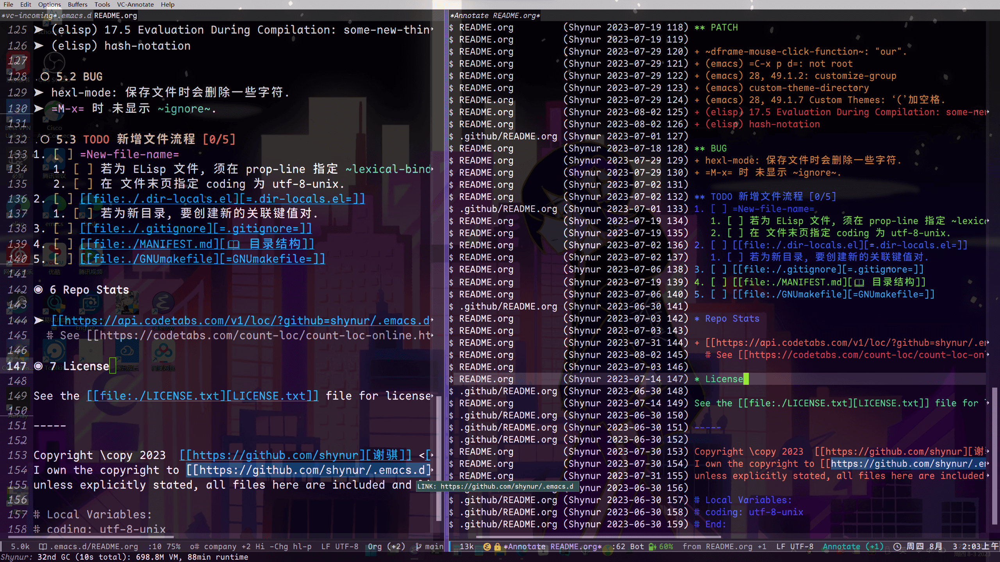

<!-- MIT License

     Copyright (c) 2023 谢骐 <https://github.com/shynur>

     Permission is hereby granted, free of charge, to any person obtaining a copy
     of this software and associated documentation files (the "Software"), to deal
     in the Software without restriction, including without limitation the rights
     to use, copy, modify, merge, publish, distribute, sublicense, and/or sell
     copies of the Software, and to permit persons to whom the Software is
     furnished to do so, subject to the following conditions:

     The above copyright notice and this permission notice shall be included in all
     copies or substantial portions of the Software.

     THE SOFTWARE IS PROVIDED "AS IS", WITHOUT WARRANTY OF ANY KIND, EXPRESS OR
     IMPLIED, INCLUDING BUT NOT LIMITED TO THE WARRANTIES OF MERCHANTABILITY,
     FITNESS FOR A PARTICULAR PURPOSE AND NONINFRINGEMENT. IN NO EVENT SHALL THE
     AUTHORS OR COPYRIGHT HOLDERS BE LIABLE FOR ANY CLAIM, DAMAGES OR OTHER
     LIABILITY, WHETHER IN AN ACTION OF CONTRACT, TORT OR OTHERWISE, ARISING FROM,
     OUT OF OR IN CONNECTION WITH THE SOFTWARE OR THE USE OR OTHER DEALINGS IN THE
     SOFTWARE.
-->

---
description: shynur
---

# 版本管理 (Version Control)

(下称 “VC”.)

## 为什么要用 VC ?

### 个人开发

(所有个人开发过程中遇到的情况同样适用于团队协作.)

1. 代码备份:
   在开发过程中, 经常会进行代码的修改和优化, 但这些改动并不总是成功或者符合预期.
   如果没有版本管理, 一旦破坏了现有代码, 可能很难恢复到之前的版本.
   VC 允许你**保存代码的历史状态**, 可以随时回滚到之前的版本.

2. 追踪功能与缺陷:
   在遇到需要新增功能或者修复缺陷的情况时, VC 允许你在代码中标记特定任务或问题, 并且可以跟踪代码的修改与解决过程.
   这样可以帮助你更好地了解代码的发展历程, 以及特定功能或缺陷的处理情况.

3. 稳定发布:
   VC 可以帮助你管理不同的开发分支.
   你可以在主分支上进行稳定的发布, 同时在其他分支上进行新功能的开发或者测试.
   这样可以保证稳定版本的可用性, 同时不会影响其他正在进行的开发工作.

### 团队协作

(待续)

### 开源场景

(待续)

## 常见工具

### 本地管理

- Git:
  由 *Linus Torvalds* 开发, 是最流行的分布式 version control system.
  本文暂且仅讨论 Git.

- Mercurial:
  另一种流行的分布式版本控制系统, 类似于 Git.
  它的目标是简单易用.

- SVN (Subversion):
  SVN 是集中式版本控制系统, 它在许多年前非常流行.
  虽然在 Git 的兴起之后逐渐减少了使用, 但在某些项目和组织中仍然得到支持.

- CVS (Concurrent Versions System):
  CVS 是早期使用最广泛的版本控制系统之一.
  它也是集中式的, 并在一些老旧项目中仍在使用.

### 在线托管平台

- Bitbucket:
  基于 Git 和 Mercurial 的代码托管平台, 也提供了一些版本控制的功能.

(待续: sr.ht, GitLab, Gitee, GNU Savannah, GitHub)

## Git (the famous one)

(有关 Git 的文章网上很多, 在此不赘述, 只提及关键的命令)

### Local Repository

我们假设项目文件的仓库位于 `~/proj`.

```bash
~/proj $ git init
         # 在此新建一个 Git 仓库,
         # 对目录下的其它内容无影响.
```

(待续)

### Push & Pull

## 前端

(待续)

### `vc.el` ([Emacs VC](https://gnu.org/s/emacs/manual/html_node/emacs/Version-Control.html))

(待续, 先插个图片)

<figure><figcaption>

### `Magit`

(待续)

<!-- Local Variables: -->
<!-- coding: utf-8-unix -->
<!-- End: -->
