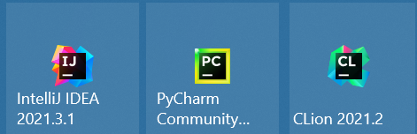

# JetBrains全家桶

jetbrains的IDE拥有强大的动态检查功能与智能补全，重构能力十分完善，可以跨平台使用与系统地管理项目，其中的CLion调试能够解析STL容器。**唯一的缺点就是特别吃电脑内存**。

这么强大的IDE，要钱吗？那是肯定的，但是，我们**可以使用校园邮箱申请到免费的教育版**

[免费教育版凭证](https://www.jetbrains.com/community/education/#students)

当然，不是每一个IDE都需要下载，本科阶段一般就用到这三个软件

当申请完成教育版的凭证后，就可以免费使用这几个强大的IDE了。


这些IDE大都不是开箱即用，需要一些时间配置。但是在Mac上几乎可以做到开箱即用（如果预先安装了XCode等的话）

